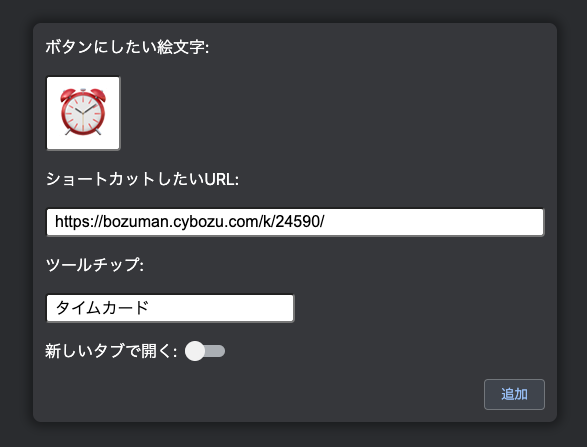

# kintone GloNavi Anchor

kintone のグローバルナビゲーションに独自のショートカットボタンを追加できる Chrome 拡張です。

## 導入方法

🚧 工事中 🚧

##ボタンの追加方法

1. Chrome 拡張機能の kintone GloNavi Anchor の項目からオプションを開く
   

2. ボタンにしたい絵文字、ショートカットしたい URL を入力して追加ボタンを押す
   

## ボタンの並び替え

- リスト項目左側のノブを掴み、ドラッグ＆ドロップすれば並び替えられます
  

## LICENSE

