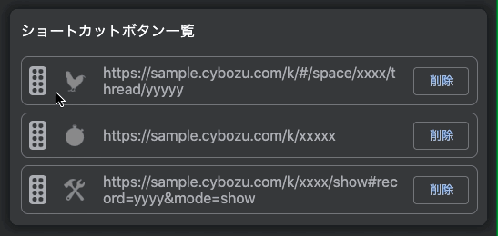

# GloNavi Anchor for kintone

kintone のグローバルナビゲーションに独自のショートカットボタンを追加できる Chrome 拡張です。

## 導入方法

Chrome ウェブストアにて拡張機能をインストールしてください。

➡️ [GloNavi Anchor for kintone](https://chrome.google.com/webstore/detail/glonavi-anchor-for-kinton/gjniipeclimojedklghnfjfioklgfllc?hl=ja)

## ボタンの追加方法

1. Chrome 拡張機能の GloNavi Anchor for kintone の項目からオプションを開く
   

2. ボタンにしたい絵文字、ショートカットしたい URL を入力して追加ボタンを押す
   

## ボタンの並び替え

- リスト項目左側のノブを掴み、ドラッグ＆ドロップすれば並び替えられます
  

## LICENSE

[MIT](https://github.com/Kyome22/GloNavi-Anchor-for-kintone/blob/main/LICENSE)

## 免責事項

この OSS は、私個人の著作物であり、サイボウズ株式会社、その他、私の所属する組織とは一切関係ありません。
